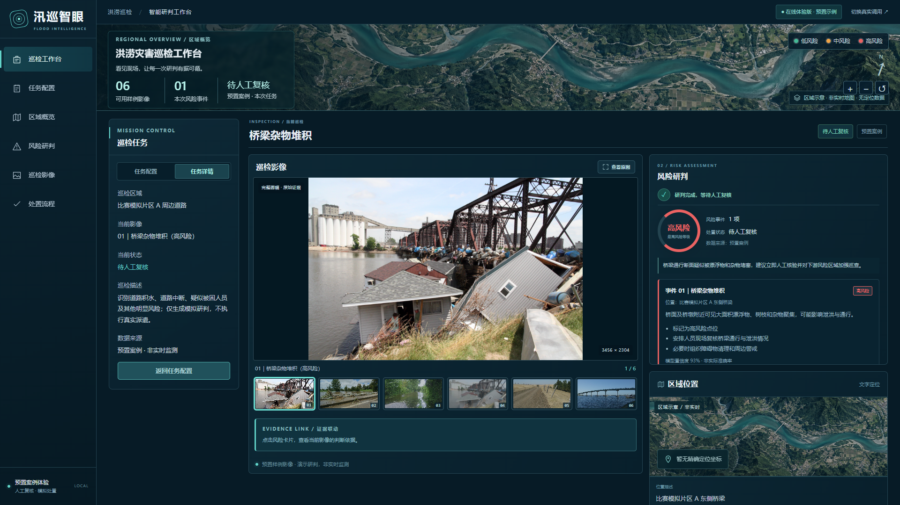
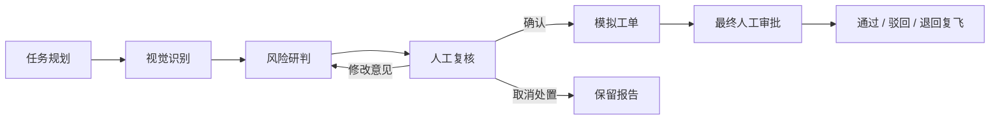
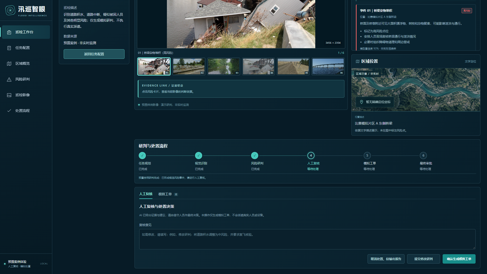
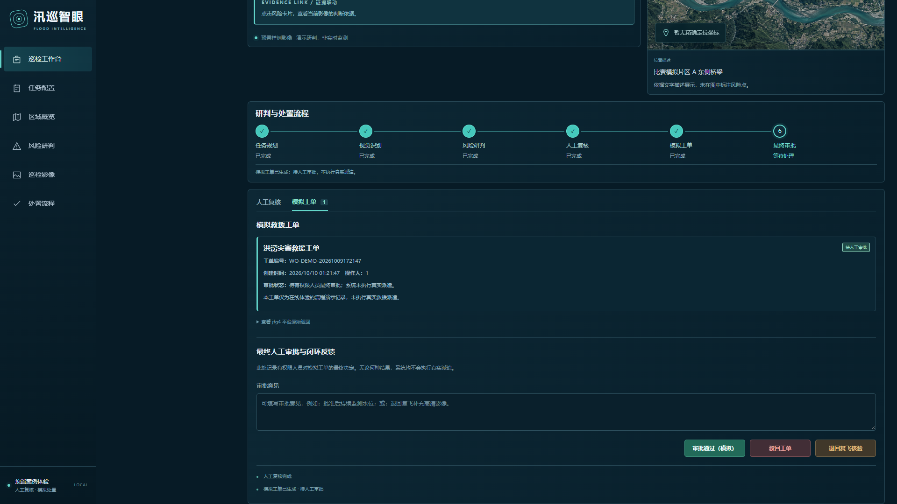
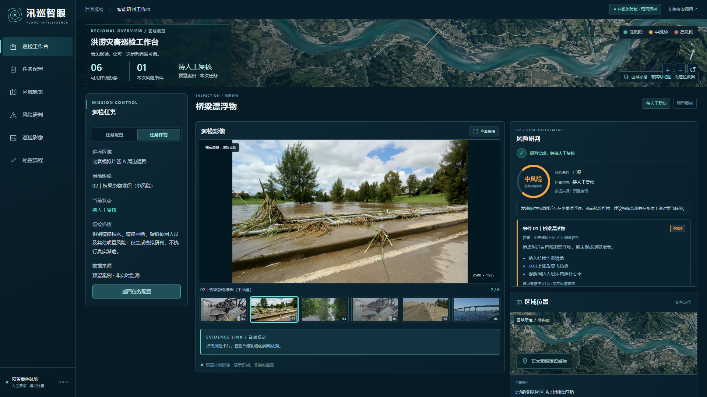
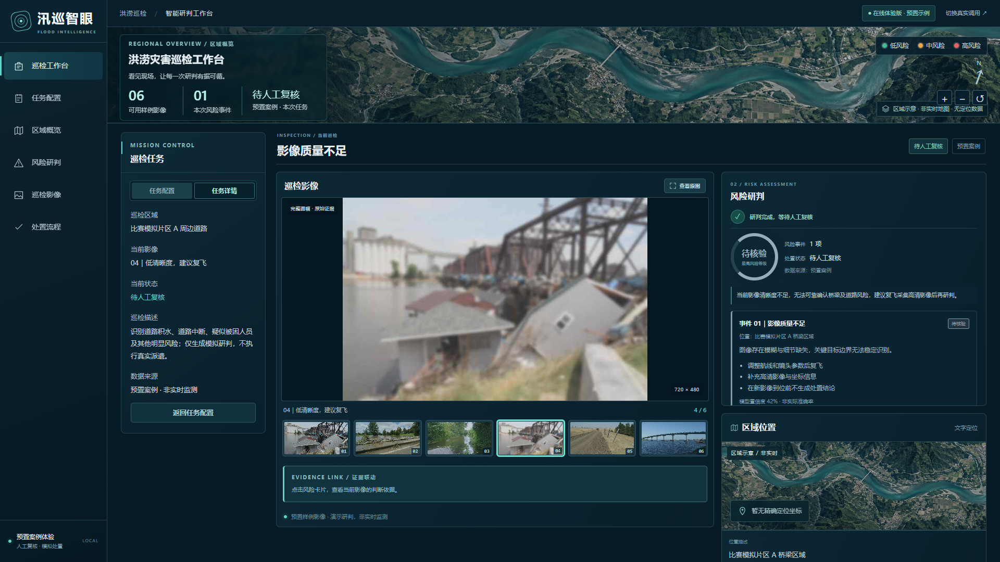
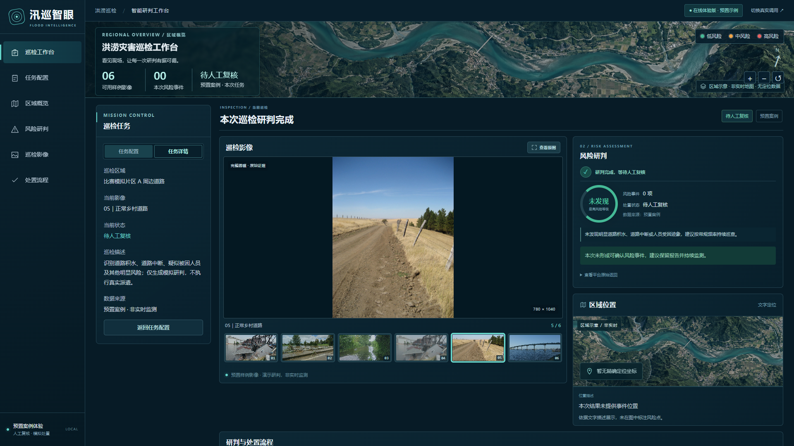

# 汛巡智眼｜洪涝灾害无人机巡检辅助决策工作台

**看见现场，让每一次研判有据可循。**

汛巡智眼面向洪涝灾害巡检场景，将巡检影像、智能体风险分析、人工复核和模拟救援工单放进同一个工作台。围绕桥梁杂物堆积、道路积水等情况，系统展示可核验的影像证据与处置建议，帮助值守人员从发现异常走到复核并记录处置决定。

[在线体验](https://ace-teng.github.io/Drone-inspection-and-rescue-for-flood-disasters/) · [前端设计与验收](docs/前端设计与验收.md) · [上传配置](docs/上传与对象存储配置.md)

> 当前项目为演示与验证原型：预置体验版用于流程展示，本地模式可连接真实智能体平台。系统不执行真实救援派遣；卫星风格地图为示意底图，不代表实时地理数据或事件精确坐标。



## 项目能力

巡检照片本身并不等于处置结论。现场需要知道哪里值得关注、依据是什么、是否需要补拍，以及由谁确认后续行动。汛巡智眼把这些环节连接起来：

| 能力 | 工作台提供的支持 |
| --- | --- |
| 影像查看 | 六组样例、缩略图切换、完整画幅与原图放大；真实模式支持上传或公网链接 |
| 风险研判 | 风险类型、等级、位置描述、视觉依据与处置建议 |
| 证据关联 | 从风险卡片查看当前影像对应的判别依据 |
| 人工复核 | 修改研判、取消处置并保留报告，或确认生成模拟工单 |
| 审批记录 | 审批通过、驳回、退回复飞核验与撤销已记录决定 |
| 异常处理 | 影像不清晰时提示待核验；无明显风险时显示零事件；输入变化后清理旧结果 |

## 从影像到处置记录



六阶段进度随任务状态更新。智能体提供辅助分析，人工复核与最终审批负责记录处置决定。

## 演示场景

以下六张图从当前本地预置案例页实际截取，对应不同风险情形和流程阶段。图中的研判来自预置数据，不是对任意上传图片的在线识别结果。

### 1. 桥梁杂物堆积：高风险

上方首屏展示任务详情、原始影像、风险等级与建议。红色强调需要优先关注的事件，风险卡片保留视觉依据，便于进一步人工核验。

### 2. 人工复核与处置决策

研判结束后进入人工复核。值守人员可以填写意见、提交修改研判、取消处置，或确认生成模拟工单。



### 3. 模拟救援工单与最终审批

确认后展示模拟工单编号、状态与审批入口。最终决定可记录为通过、驳回或退回复飞，形成可查看的流程记录。



### 4. 桥梁漂浮物：中风险

橙色等级提示区分中风险情形，页面展示持续监测、水位变化后复飞核验等预置建议。



### 5. 影像质量不足：待核验

面对低清晰度影像，页面显示“待核验”，提示补充高清影像后再研判，避免把不清晰的证据当作确定结论。



### 6. 正常道路：未发现明显风险

正常道路样例展示零风险事件与“未发现”状态，并建议保留报告、持续巡查。“未发现”表示当前影像未形成可确认风险事件，不等于现场绝对安全。



其他样例包括道路积水和正常桥梁。六张原始素材及来源见 [测试影像说明](assets/test-images/README.md)。

## 快速体验

安装 **Node.js 18+**，在项目目录运行：

```bash
npm install
node real-demo-server.mjs
```

打开 **http://127.0.0.1:8789/experience/**，选择样例并点击“启动在线巡检研判”，即可体验人工复核、模拟工单和审批流程，不需要智能体密钥或校园网。

| 模式 | 入口 | 适用用途 |
| --- | --- | --- |
| 预置案例 | 在线体验页或本地 `/experience/` | 使用固定样例与预置结果演示完整交互 |
| 真实调用 | 本地 `/` | 后端提交影像链接与任务，呈现平台实际返回结果 |

预置模式上传的图片仅供预览；真实分析需要切换真实调用模式，配置平台密钥与网络，并提供平台可读取的公网图片直链。

## 技术架构

前端使用原生 HTML、CSS 和 JavaScript，真实调用与预置体验共用视觉样式和工作台交互层。Node.js 服务负责页面、上传、平台调用及模拟审批记录，阿里云 OSS SDK 负责对象存储接入。预置体验页可作为静态站点发布，平台凭据保留在后端。

- `online-experience/ui.css`、`ui.js`：共享视觉样式与页面布局。
- `online-experience/workspace.js`：研判展示、证据关联与工作台状态管理。
- `real-demo-server.mjs` 与 `lib/`：HTTP 服务、平台调用、诊断与存储。
- `tests/browser-acceptance.mjs`：可选浏览器验收，运行方法见 [前端设计与验收](docs/前端设计与验收.md)。

## 在线体验版

仓库发布后可通过 GitHub Pages 访问在线体验页：

`https://ace-teng.github.io/Drone-inspection-and-rescue-for-flood-disasters/`

在线版复用本项目真实演示页面和完整交互闭环，使用预置巡检样例，因此不暴露 `BAILIAN_APP_KEY`、对象存储凭据或校园网内接口。真实智能体调用、上传对象存储与现场答辩，请按以下本地启动说明进行。

## 真实调用配置（Windows）

前提：安装 Node.js 18+，并连接校园网。

1. 下载本项目。
2. 在项目目录运行 `npm install`（安装对象存储 SDK `ali-oss`）。
3. 将 `.env.example` 复制并改名为 `.env.local`。
4. 在 `.env.local` 中填入百炼 `BAILIAN_APP_KEY`（不要上传此文件）。若未创建该文件，双击启动器时也可临时粘贴密钥。
5. 双击 `启动演示.cmd`。
6. 浏览器打开 `http://127.0.0.1:8789/`。

也可在终端运行：`npm run demo`。

## 本地前端预览

运行演示服务后，打开 `http://127.0.0.1:8789/experience/` 可体验预置案例，不需要校园网或智能体密钥；可以切换素材、查看放大影像、演示研判和模拟工单审批。若仅查看前端，可直接运行 `node real-demo-server.mjs`。

`http://127.0.0.1:8789/` 保留真实智能体调用，需要按上面的步骤配置密钥与网络。两种模式共用 `online-experience/ui.css`、`online-experience/ui.js` 和 `online-experience/workspace.js` 展示与交互层。

## 页面与队员版本不一致时

`npm run demo` 会显示项目目录、当前分支和提交号，以及真实调用和预置案例两个地址。队员最新界面在 `main` 分支；请先保存本地改动，再用 `git switch main` 和 `git pull --ff-only origin main` 同步。切换分支或更新服务代码后，停止旧服务再重新启动；仅刷新网页不会更新旧 Node 进程内的页面。

真实调用入口 `/` 与预置案例入口 `/experience/` 使用同一套前端。预置案例页右上角标明“在线体验版 · 预置示例”，可直接演示完整流程；真实调用页需要校园网和平台配置。若终端提示端口被占用，本次启动没有成功，此时该地址仍可能指向旧服务。

## 三种巡检图片来源

平台在另一台机器上，只能读取**公网可访问的图片直链**；本机 `127.0.0.1` 地址它读不到，所以这类链接会在调用平台之前就被拒绝。

1. **上传本机图片**（推荐）：选择 JPG/PNG → 点击“上传并作为巡检图片”→ 后端存入对象存储并把返回的直链填入“公网图片链接”。需要先配置对象存储，见 [docs/上传与对象存储配置.md](docs/上传与对象存储配置.md)。
2. **自带测试素材**：`assets/test-images/` 的 6 张图，选中即可在本页预览。清单 `assets/test-images/test-image-catalog.json` 里配置了长期直链的素材会自动填入链接；没有配置的只能预览，需要真实调用时请改用上传。
3. **自己填公网直链**：直接把任何公网可访问的 JPG/PNG 直链粘进“公网图片链接”。

> 不要使用临时图床（uguu.se、catbox 等）。这类直链几小时到几天就会过期，过期后平台读图静默失败。服务启动时会拒绝并告警这类链接。

## 环境变量

真实取值只写在不提交的 `.env.local`；`.env.example` 只列变量名和说明。密钥绝不能进入 HTML、前端 JS 或 Git。

| 变量 | 用途 |
| --- | --- |
| `BAILIAN_APP_KEY` | 智能体平台密钥（必填） |
| `PORT` | 演示端口，默认 8789 |
| `BAILIAN_API_BASE` | 覆盖智能体网关地址（本地测试用假网关时使用） |
| `DEMO_DEFAULT_IMAGE_URL` | 覆盖默认演示图片直链 |
| `DEMO_ALLOW_LOCAL_IMAGE_URLS` | 允许把本机地址当作图片直链提交（默认关闭） |
| `STORAGE_DRIVER` | `aliyun-oss` 或 `local`（本地联调） |
| `OSS_REGION` / `OSS_BUCKET` / `OSS_ACCESS_KEY_ID` / `OSS_ACCESS_KEY_SECRET` | 阿里云 OSS 配置，只放后端 |
| `OSS_PREFIX` / `OSS_ENDPOINT` / `OSS_CNAME` / `OSS_PUBLIC_BASE_URL` | 可选：对象前缀、自定义 endpoint、自定义域名、对外基础地址 |
| `UPLOAD_MAX_BYTES` | 单张图片上限，默认 8 MiB |

## 本地自动化测试

```
npm test
```

不需要密钥，不访问智能体平台，不访问外网（平台调用由内置假网关模拟）。覆盖素材清单、本地预览与路径穿越、上传校验与各类错误分支、模拟工单审批落盘，以及平台失败的分阶段诊断。

## 排查：调用失败时看 stage

失败信息统一带 `【stage】`、排查提示和非敏感诊断信息。常见 stage：

| stage | 含义 | 该找谁 |
| --- | --- | --- |
| `config.missing_key` | 本机没配 `BAILIAN_APP_KEY` | 自己补 `.env.local` |
| `input.invalid` | 缺任务描述/图片链接/会话号等 | 自己修输入 |
| `image.rejected` | 图片链接不可用（如本机地址） | 改用上传或公网直链 |
| `image.unreachable` | 图片链接返回 4xx/5xx（常见于过期图床） | 换图片 |
| `createSession.network` / `.timeout` | 连不上平台 | 检查校园网 |
| `createSession.rejected` | 平台拒绝建会话 | 看提示；若标注平台故障则等平台恢复 |
| `run.rejected` | 平台拒绝执行 | 看平台给出的原因 |
| `run.empty` | 平台返回成功但没有文本输出 | 先确认图片能无登录打开，再查工作流输出节点 |
| `upload.*` | 上传被本地校验或存储拒绝 | 按提示修文件或配置 |

被判定为平台侧故障时，信息里会明确写“平台侧故障（external blocker），本地代码与本机配置无需修改”。

## 目录

- `real-demo-server.mjs`：网页与平台真实调用
- `run-demo.mjs`：读取本机密钥并启动
- `启动演示.cmd`：双击启动
- `assets/test-images/`：6 张测试图、图片授权，以及素材清单 `test-image-catalog.json`
- `lib/`：路径、素材清单、平台调用诊断、对象存储与阿里云 OSS driver（都可单独测试）
- `tests/`：本地自动化测试（Node 内置 test runner，无第三方依赖）
- `docs/`：队员验收说明与上传配置说明

## 项目边界与更多文档

项目尚未接入真实无人机飞控、实时航线或救援调度系统。模型置信度不等同于实际准确率；现场情况需要人工核验，最终审批也仅记录模拟处置决定。

- [队员协作与验收说明](docs/队员协作与验收说明.md)
- [前端设计与验收](docs/前端设计与验收.md)
- [视觉定位接入核查](docs/视觉定位接入核查.md)
- [本地 GIS 改版验收记录](docs/本地GIS改版验收记录.md)
